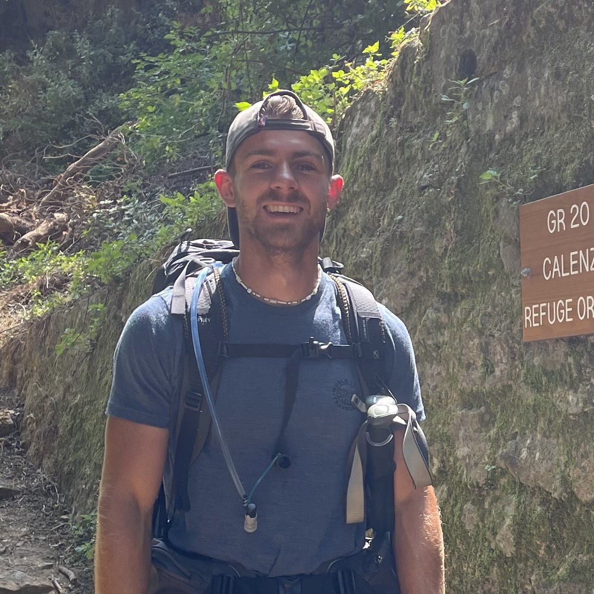



CExA organizes the 14th **Kokkos tea-time** on Wednesday, December the 17th, 2025 for 45min starting at [7AM Pacific, 10AM Eastern, 4PM Paris, 11PM Tokyo](https://www.worldtimebuddy.com/?qm=1&lid=8,5,2988507,1850147&h=8&date=2025-12-17&sln=7-8).
It can be followed on [Zoom](https://zoom-lfx.platform.linuxfoundation.org/meeting/92397190835?password=b177af2d-9c4a-4376-9d17-b57588a88146), or by [phone]().



Ugo Battiston will give a talk entitled "Connecting Kokkos with the Polyhedral Model"

Ugo Battiston is a third-year PhD student in the CAMUS team at Inria Strasbourg. Following a Master's degree in High-Performance Computing and Simulation from Paris-Saclay University, his research now focuses on program optimization and compilation leveraging the polyhedral model.

<!--{}-->

<!--  -->

## Connecting Kokkos with the Polyhedral Model

How can we maximize the compile time performance of a compute library using the polyhedral model? By making the library's abstractions transparent to static analysis, we enable the application of aggressive loop transformations via Polly (an LLVM project), operating directly on the Intermediate Representation.

## Additional info

### Zoom link

In a web browser or from the application.

https://zoom-lfx.platform.linuxfoundation.org/meeting/92397190835?password=b177af2d-9c4a-4376-9d17-b57588a88146
* Meeting ID: 923 971 90835
* Passcode: 218480

### One tap mobile

* France: +33170950350,,92397190835#,,,,*218480#
* France: +33186995831,,92397190835#,,,,*218480#
* US: +12532158782,,92397190835#,,,,*218480#
* US: +13462487799,,92397190835#,,,,*218480#

### By phone

* Meeting ID: 923 971 90835
* Meeting Passcode: 218480

Dial by your location
* +33 1 7095 0350 France
* +33 1 8699 5831 France
* +49 695 050 2596 Germany
* +49 69 7104 9922 Germany
* +1 564 217 2000 USA
* +1 646 931 3860 USA
* +81 3 4579 0545 Japan
* +81 3 4579 0432 Japan
* [Numbers for other countries](https://zoom.us/u/alwnPIaVT)
