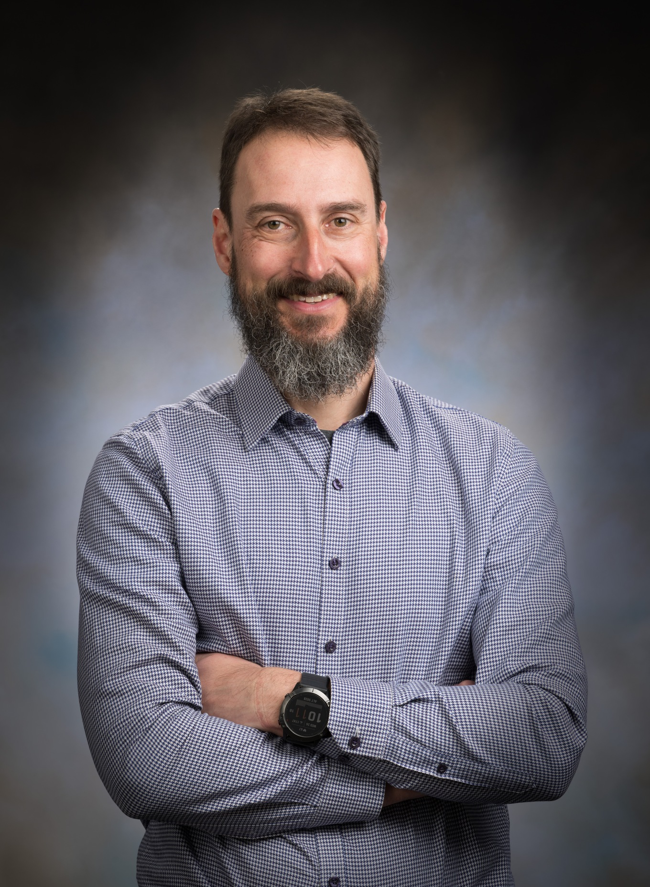



CExA organizes the 13th **Kokkos tea-time** on Wednesday, September the 17th, 2025 for 45min starting at [7AM PDT, 9AM MDT, 11AM EST, 3PM UTC, 4PM CEST](https://www.worldtimebuddy.com/?qm=1&lid=12,100,5,7,8&h=12&date=2025-03-19&sln=16-17&hf=1).
It can be followed on [Zoom](https://zoom-lfx.platform.linuxfoundation.org/meeting/92397190835?password=b177af2d-9c4a-4376-9d17-b57588a88146), or by [phone]().



Wolfgang Bangerth will give a talk entitled "Experience converting large scientific software packages written in C++ to C++20 modules"

Wolfgang Bangerth is a professor of mathematics and geosciences at Colorado State University, USA. He holds an undergraduate degree in physics, and a PhD in mathematics from Heidelberg University, Germany. As a graduate student in 1997, he co-founded the deal.II project (https://www.dealii.org), a widely used software library that provides finite element functionality. He is now one of the Principal Developers of the project.

<!--{}-->

## Experience converting large scientific software packages written in C++ to C++20 modules

Many of the most widely used scientific software libraries are written in C++, but almost all of them still use the traditional header-based approach inherited from C to connect declarations provided in one file to uses and implementations in another file. On the other hand, C++20 has introduced a module system that is intended to give C++ a proper "import" statement that goes beyond the textual inclusion of "#include".

In this talk, I will outline my experience with converting the deal.II finite element library -- a library with 1.8M lines of C++ -- to use C++20-style modules. I will discuss how I did this from a technical perspective, and in particular how that actually works in practice.

## Contribute

Any subject is welcome if it is related to the Kokkos ecosystem (developments, usage, projects, issues, etc.) or even to GPU programming at large.
Feel free to contact us to propose a talk: contact@cexa-project.org

We target very informal discussion in English. You can propose any subject for discussion even if you don't have a dedicated slide deck.

## Additional info

### Zoom link

In a web browser or from the application.

https://zoom-lfx.platform.linuxfoundation.org/meeting/92397190835?password=b177af2d-9c4a-4376-9d17-b57588a88146
* Meeting ID: 923 971 90835
* Passcode: 218480

### One tap mobile

* US: +12532158782,,92397190835#,,,,*218480# or +13462487799,,92397190835#,,,,*218480#

### By phone
* US: +1 253 215 8782 or +1 346 248 7799 or +1 669 900 6833 or +1 301 715 8592 or +1 312 626 6799 or +1 646 374 8656 or 877 369 0926 (Toll Free) or 855 880 1246 (Toll Free)
* Canada: +1 647 374 4685 or +1 647 558 0588 or +1 778 907 2071 or +1 204 272 7920 or +1 438 809 7799 or +1 587 328 1099 or 855 703 8985 (Toll Free)

* Meeting ID: 92397190835
* Meeting Passcode: 218480
* [International numbers](https://zoom.us/u/alwnPIaVT)

